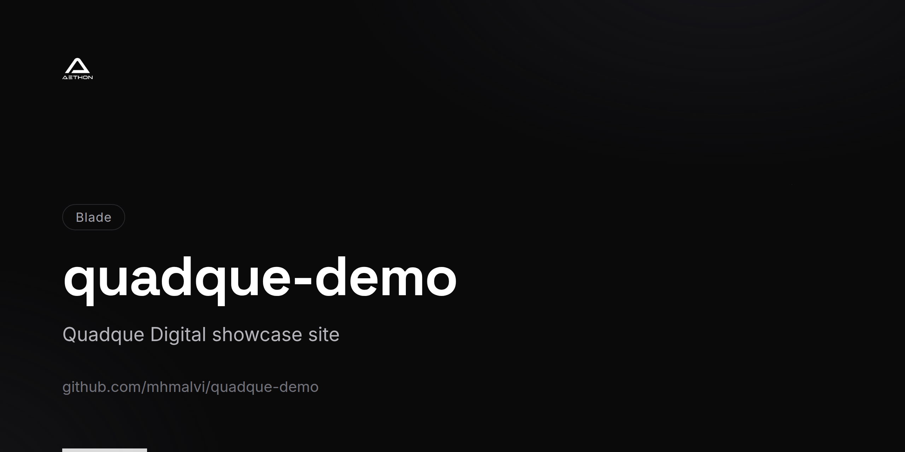
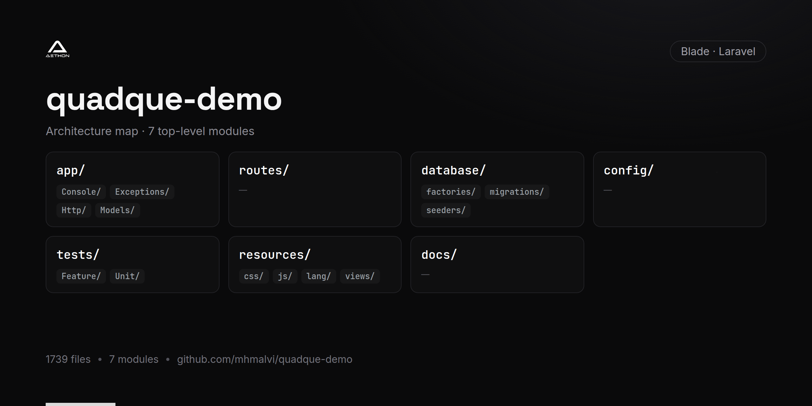

<!-- repo-card -->




# Quadque Demo

The demo and showcase site for **Quadque Technologies**. This Laravel 8 application provides a live demonstration environment where prospective clients can explore platform capabilities, sample features, and interactive previews of the Quadque service offerings.

Part of the **Quadque digital platform ecosystem**.

---

## Features

- Interactive demo environment showcasing platform capabilities
- Laravel Sanctum authentication for secure demo access
- SEO-friendly configuration with robots.txt and favicon management
- CORS support for cross-origin demo embedding
- Blade-powered server-rendered pages with Laravel UI styling
- Guzzle HTTP client for backend API communication
- Database-driven demo content with migrations and seeders
- Clean URL routing with .htaccess configuration

## Tech Stack

| Layer        | Technology                                  |
|--------------|----------------------------------------------|
| Backend      | PHP 7.3+/8.0, Laravel 8                     |
| Auth         | Laravel Sanctum                              |
| Frontend     | Blade Templates, Laravel UI                  |
| HTTP Client  | Guzzle 7                                     |
| CORS         | Fruitcake Laravel CORS                       |
| Build        | Laravel Mix 6, Webpack                       |
| Testing      | PHPUnit 9, Mockery, Faker                    |

## Getting Started

### Prerequisites

- PHP >= 7.3
- Composer
- Node.js >= 14
- MySQL

### Installation

```bash
git clone https://github.com/mhmalvi/quadque-demo.git
cd quadque-demo
composer install
npm install
```

### Environment Configuration

```bash
cp .env.example .env
php artisan key:generate
```

Update `.env` with your database credentials and demo environment settings.

### Database Setup

```bash
php artisan migrate
php artisan db:seed
```

### Development

```bash
php artisan serve
npm run dev
```

## Project Structure

```
quadque-demo/
├── app/                 # Application logic
├── bootstrap/           # Framework bootstrap
├── config/              # Configuration files
├── database/
│   ├── factories/       # Model factories
│   ├── migrations/      # Database migrations
│   └── seeders/         # Database seeders
├── public/              # Public assets and entry point
├── resources/
│   ├── views/           # Blade templates
│   └── css/             # Stylesheets
├── routes/
│   ├── api.php          # API routes
│   └── web.php          # Web routes
├── storage/             # Logs and cache
├── robots.txt           # Search engine directives
└── webpack.mix.js       # Build configuration
```

## License

Proprietary — Quadque Technologies. All rights reserved.
